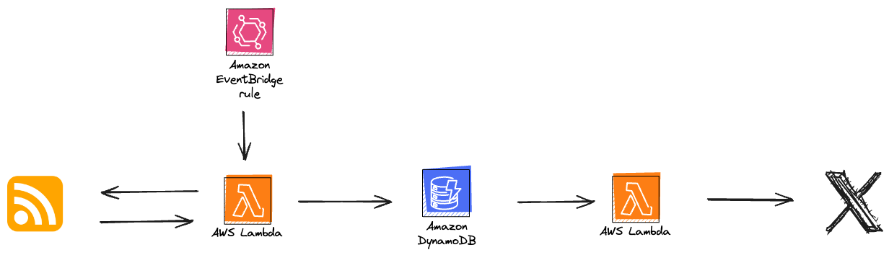

# Exploring AWS Serverless Deployments with CDK v2: From RSS to X Posts

This repository provides a serverless solution for creating posts on X from an RSS feed. Leveraging Lambda Functions, an Amazon EventBridge rule and DynamoDB. This solution automates the process of fetching new content from an RSS feed and publishing it on X.

Blog post series:

[Exploring AWS Serverless Deployments with CDK v2: From RSS to X Posts - Part 1 of the Odyssey](https://adrianthegreat.com/2024/03/23/Exploring-AWS-Serverless-Deployments-with-CDK-v2-From-RSS-to-X-Posts-Part-1-of-the-Odyssey)

[Exploring AWS Serverless Deployments with CDK v2: From RSS to X Posts - Part 2 of the Odyssey](https://adrianthegreat.com/2024/03/24/Exploring-AWS-Serverless-Deployments-with-CDK-v2-From-RSS-to-X-Posts-Part-2-of-the-Odyssey)

[Exploring AWS Serverless Deployments with CDK v2: From RSS to X Posts - Part 3 of the Odyssey](https://adrianthegreat.com/2024/07/27/Exploring-AWS-Serverless-Deployments-with-CDK-v2-From-RSS-to-X-Posts-Part-3-of-the-Odyssey)
